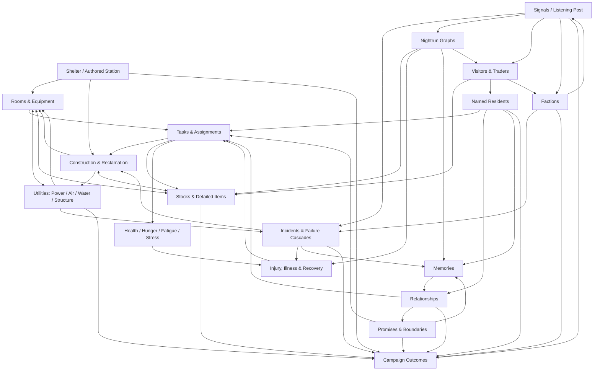

# Signal 45 — Core Loop and Campaign

## Loop hierarchy

### 20–40 second interaction loop

**Notice → Inspect → Choose → Commit → Read response**

1. Notice a visible state change, forecast, task opportunity, resident need, or signal alert.
2. Tap the relevant room, resident, object, or alert; Room Focus or a contextual panel exposes only relevant actions.
3. Compare effect, duration/work, resource/component cost, utility consequence, and human concern.
4. Assign, prioritize, place, route, or confirm; irreversible actions include confirmation and undo where physically plausible.
5. Receive immediate visual and numerical feedback: a resident moves, a blueprint appears, a network path changes, a forecast updates, or a promise is recorded.

This loop must feel worthwhile before long timers or narrative payoff. Prompt 2 budgets the sequence at 32 seconds: 4 notice, 5 selection/camera, 8 reading, 8 choice, 3 confirmation, and 4 initial response. Only a playable build can validate it.

### 2–5 minute action loop

**Assess one problem → Make a short plan → Execute linked actions → Stabilize → Bank progress**

Examples include reclaiming a bay, treating an injury, preparing air for a storm, converting a temporary room, or planning a nightrun. A typical action loop touches two or three systems, not every system: survey rubble, assign Ash, divert power, then install a partition; or inspect coughing, pause dusty work, assign Imka, and consume a medical item.

The loop ends at a safe state: a project is queued with forecasted consequences, treatment has begun, a signal commitment is made, or an incident is stabilized.

### 5–12 minute mobile shelter session

1. **Resume safely:** the game states that no simulation time passed while closed and surfaces the last committed state.
2. **Read the station:** review day/phase, five stock resources, urgent issue, resident portraits, and one forecast.
3. **Set intent:** choose one primary goal, such as securing water, opening East, treating a resident, or preparing a run.
4. **Operate:** make several 20–40 second decisions across rooms and people; watch the station respond at an adjustable speed.
5. **Handle one complication or opportunity:** a signal, visitor, disagreement, equipment fault, or forecast change.
6. **Review consequences:** see updated resource/utility outlook, promises, and next risks.
7. **Stop safely:** pause at a phase boundary, completed decision, stabilized incident, or serialized expedition node.

An optional active nightrun can extend a session. It is never required merely to reach a safe save point.

### Full in-game day

**Forecast → Maintain and build → Reconcile and prepare → Run or recover → Count consequences**

- Establish weather, needs, capacity, and immediate risks.
- Allocate work among production, treatment, maintenance, construction, listening, and rest.
- Commit one or more meaningful shelter changes, with ordinary resident activity visible.
- Decide which signal or outside opportunity deserves scarce attention.
- Prepare a nightrun or explicitly remain underground.
- Resolve consumption, utility wear, exposure, memories, promises, relationships, incidents, and progress.
- Enter the next day from a serialized state with a plain-language change summary.

Prompt 2 budgets an ordinary day at 7.5 minutes and six meaningful decisions, a delegated-nightrun day at 9.1 minutes and eight decisions, and an active-nightrun day at 12.3 minutes and twelve decisions. These remain modeled targets, not measured pacing.

### 45-day campaign loop

**Survive → Stabilize → Specialize → Learn → Commit → Resolve**

Over repeated days the player turns emergency capacity into reliable infrastructure, grows from four people toward a normal 10–14, chooses which station branches to reclaim, builds redundancy, forms relationships with visitors and factions, assembles evidence about Signal 45, and prepares at least one credible Day 45 plan. The campaign evaluates the accumulated physical and human state rather than resetting between acts.

## Day phases

The railway-native names are retained but always paired with plain-language labels in onboarding and accessibility settings.

| Phase | Plain-language label | Function | Dominant decisions | Safe stopping point |
|---|---|---|---|---|
| **Swelter** | Day Shift | Surface heat is worst; the community works underground. | Production, construction, reclamation, treatment, maintenance, utility routing, visitor handling. | After any project transaction or stabilized incident; backgrounding pauses immediately. |
| **Slack** | Evening Window | Heat falls and the station prepares for night. | Rest rotations, meals, equipment loadout, signal review, forecasts, promises, route choice, gate policy. | Before committing a nightrun and after all shelter orders are serialized. |
| **Nightrun** | Night Operation | Surface travel is temporarily possible. | Send nobody, delegate a route, or actively direct node-to-node movement; balance time, noise, air protection, carry, danger, and retreat. | At each secured node and before/after every irreversible encounter; committed results serialize atomically. |
| **Graymorn** | Return and Report | Travelers return and the station counts what changed. | Triage, inventory, debrief, relationship reactions, promise checks, incident aftermath, next forecast. | After the day ledger is accepted; this is the strongest between-session boundary. |

Phase names are flavor, not comprehension tests. “Day Shift,” “Evening Window,” “Night Operation,” and “Return and Report” can be shown permanently when enhanced clarity is enabled.

## Resource and decision rhythm

- **Stocks:** Food, Clean Water, Medicine, Materials, Charge.
- **Utilities:** Power, Air, Water, Structure. These report networks and condition, not currency balances.
- **Resident conditions:** Health, Hunger, Fatigue, Stress. Contextual states such as respiratory exposure, grief, injury, or contamination modify behavior without becoming permanent bars.
- **Attention:** Listening commitment is a scheduling constraint at the Listening Post, not a sixth stock resource.

The intended rhythm alternates legibility and commitment: forecast a risk, choose work, watch physical progress, absorb a human or systemic complication, then create a recovery plan. Pressure should rise through linked causes, crest in a short incident, and release through competence, care, visible repair, or communal life.

## Emotional rhythm

| Beat | Player feeling | Supporting play |
|---|---|---|
| Exposure | “This station is not safe yet.” | Visible rubble, leaks, weak light, coughing, limited routes. |
| Comprehension | “I understand what will fail and why.” | Forecasts, overlays, resident concerns, signal confidence. |
| Commitment | “I chose what matters most.” | Route, staffing, construction, listening, or expedition choice. |
| Pressure | “My plan is being tested.” | Resource tradeoff, storm, injury, visitor, promise collision. |
| Recovery | “We can repair this.” | Treatment, isolation, backup, rest, negotiation, retreat. |
| Belonging | “This is becoming their home.” | Warm light, personal activity, meals, decoration, repaired spaces. |
| Consequence | “The station remembers what I did.” | Physical changes, memories, relationships, evidence, later options. |

Hopelessness is not the default endpoint. Even a costly day should usually expose a credible next action.

## Three-act campaign

### Act I — Refuge (Days 1–7)

- Establish four residents, survival stocks, and the five-workflow interaction grammar.
- Reclaim the first route, build and upgrade initial rooms, and learn four utilities.
- Follow the first meaningful signal and complete or delegate the first compact nightrun.
- Face the first storm, failure cascade, outside group, and conditional admission.
- End **The First Count** with a visibly larger shelter and a declared but revisable settlement priority.

### Act II — Settlement (approximately Days 8–30)

- Convert emergency rooms into durable forms and add redundancy.
- Grow toward 10–14 residents with capacity, work, treatment, food, privacy, and social consequences.
- Restore larger station sections, vertical access, trade routes, and specialized workshop/utility modules.
- Develop faction relationships through specific exchanges and promises rather than a universal reputation bar.
- Cross-check contradictory Signal 45 evidence and build infrastructure useful for more than one ending.
- Introduce security, sabotage, and dangerous encounters without creating a combat power curve.

### Act III — Commitment (approximately Days 31–44)

- Resolve major contradictions about Signal 45 and expose remaining uncertainty honestly.
- Commit scarce time and station space to evacuation, permanence, relay-network, or contingency preparations.
- Bring faction, relationship, and promise consequences into construction and staffing decisions.
- Survive a major structural/environmental threat that tests redundancy and route choices.
- Make final preparations that visibly occupy the station and constrain what can still be changed.

### Day 45 — Resolution

The ending evaluator considers at minimum:

- verified and missed evidence;
- evacuation, permanence, relay, and backup infrastructure;
- utility resilience and stored essentials;
- station access and structural condition;
- resident health and willingness;
- population/capacity fit;
- promises, relationships, and faction obligations;
- who was admitted, lost, protected, or alienated;
- the player’s final operational action.

The final action can choose among earned plans, but cannot manufacture an unprepared ending.

## System map

## Offline, pause, and safe-state contract

- Backgrounding or closing saves and pauses the authoritative simulation clock.
- No food/water consumption, construction, recovery, utility wear, incident escalation, or resident death occurs while closed.
- Expedition results resolve only at explicit committed nodes; the transaction is serialized before presentation.
- Returning after any absence says **“Paused while away—no station time passed.”**
- Every modal decision pauses by default; simulation speed is adjustable and can be paused at any time outside narrowly authored committed animations.
- A reload must recreate stocks, networks, tasks, residents, room/equipment states, incidents, signal commitments, expedition node, memories, relationships, promises, forecasts, and random-stream state exactly.

These are design contracts. Save correctness and interruption recovery require technical prototypes before they are considered validated.
