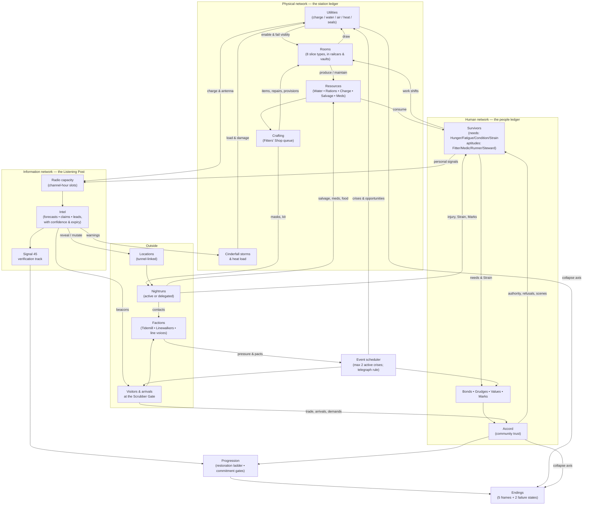

# 02 — GAMEPLAY LOOPS, EMOTIONAL RHYTHM, AND CAMPAIGN STRUCTURE

**Status:** LOCKED at structural level. Numeric tuning values are placeholders for the systems stage; structure and phase names are canon.

---

## 1. Time model (foundation for all loops)

- The in-game day advances through **four named phases**: **Swelter → Slack → Nightrun → Graymorn**. Phases advance when the player completes their decisions and confirms, not on a wall clock. Within a phase, station activity plays out in gently animated simulated time that the player can pause freely; nothing in the base game requires reaction speed.
- **Time never advances while the app is closed.** There is no offline decay and no offline yield (Anti-pillar 1; offline-safety quality gate). Reopening the game resumes exactly at the last confirmed state.
- Every phase boundary is an **autosave and a marked safe stop**. The active nightrun is the only real-time segment (3–6 min); it pauses on interruption and can always be abandoned-in-place to delegate resolution.

## 2. The 30-second interaction loop

The atomic unit of play — **Notice → Inspect → Decide → Commit → Feedback**:

1. **Notice** a signal in the cutaway or ledger: a browning lamp string, a survivor's slumped idle, a badge on the Listening Post, a visitor silhouette at the gate.
2. **Inspect** with one tap: the room panel or ledger page states cause, trajectory, and stakes in one screen ("Scrubber intake clogging — Air margin 2 days — storm inbound").
3. **Decide** among 2–4 concrete options, each previewing its **physical-ledger cost** (charge, salvage, hours, risk). Human-ledger effects are hinted, not quoted (Pillar 2's discovered consequences).
4. **Commit** with a confirming tap; the order posts to the day's work plan.
5. **Feedback** within seconds: the assigned survivor walks to the job, audio acknowledges, the gauge trajectory updates — and the consequence itself may land minutes or days later.

Feeds upward: 3–6 of these loops constitute one phase's decision set.

## 3. The 5–12 minute mobile-session loop

A session is designed to cover **one to two phases comfortably**, or a full day when decisions are light:

1. **Re-orient (30–60 s):** stationmaster's log recaps state; the cutaway shows everything at overview zoom; any overnight report replays consequences with causes.
2. **Work the phase (3–8 min):** the phase's decision set — Swelter's work orders and visitor calls, or Slack's radio schedule and run planning, or a Nightrun (active or delegated), or Graymorn's triage and report.
3. **Close at a safe stop (30–60 s):** confirm the phase; autosave; the log entry writes itself; a "safe to stop" marker appears. The next phase's headline is previewed so the player leaves with an intention, not a cliffhanger anxiety.

A player with 5 minutes completes one phase; with 12, a full day. The active nightrun option fits the session budget (3–6 min) and is always substitutable by delegation.

## 4. The in-game day loop

| Phase | Fiction | Player activity | Dominant ledger | Typical length |
|---|---|---|---|---|
| **Swelter** | Surface lethal; heat load peaks; station works | Work orders, construction/repair, crafting queue, visitor negotiations, conflict arbitration | Physical, with human interrupts | 3–6 min |
| **Slack** | Dusk; heat falls; the day's one true planning window | Radio schedule (the signature decision), nightrun planning and provisioning, tomorrow's priorities | Information | 2–4 min |
| **Nightrun** | Cool dark; the door opens | Active run (3–6 min) or delegate-and-advance; meanwhile the station runs its quiet shift | Expedition | 0–6 min |
| **Graymorn** | Pre-dawn return; the accounting | Return and triage, arrivals at the gate, event consequences land, stationmaster's log | Human | 2–4 min |

Feeds upward: each day writes deltas to stockpiles, utility states, needs, bonds/Marks, intel confidence, and faction posture — the campaign's working memory.

## 5. The campaign loop (35–50 days; slice: 7)

The repeating multi-day cycle that gives weeks their shape:

1. **Storm cycle (every 4–7 days):** forecastable cinderfall storms force preparation crescendos, sealed-in days (no nightrun; internal focus), and post-storm recovery/salvage windows. The rhythm section of the campaign.
2. **Relay cycle (weekly):** Signal 45 re-broadcasts on Relay Nights with progressively verifiable content — the campaign's hope metronome and the verification track's checkpoints.
3. **Restoration ladder:** each act, a major station capability can be restored (Level-3 lighting, second cistern, antenna mast…), changing daily play and delivering scheduled hope beats.
4. **Faction and visitor arcs:** contacts made through radio and runs mature into arrivals, trades, demands, and act turning points.
5. **Commitment gates:** at act boundaries, the player makes a standing commitment (what to prepare for) that re-weights events, trades, and available endings — revisable, at a cost, until Act 3 locks it.

## 6. Emotional rhythm

The seven registers and where the design deliberately places them:

- **Pressure** — Swelter phases, storm approach, visitor demands. Capped: max 2 simultaneous active crises (slice); new pressure always telegraphs (Pillar 5).
- **Planning** — Slack. Mechanically the calmest phase; music floor drops; no crisis may *begin* during Slack.
- **Activity** — work orders resolving in Swelter; the nightrun itself.
- **Discovery** — nightrun locations, radio intel, arrivals; the human ledger's delayed reveals ("so *that's* why Teo's been off his food").
- **Consequence** — Graymorn by design: the accounting phase. Consequences land with stated causes, referencing the decision that bought them.
- **Recovery** — post-storm days, restoration beats, the canteen scene class of content; mechanically real (Strain relief, Accord gain).
- **Hope** — Relay Nights, restorations, arrivals who are what they claimed, the endings themselves.

**Anti-monotony rules:** never two sealed-storm days without a recovery day following; never a Relay Night and a storm on the same day; a hope beat within every 3-day window, weighted toward earned (state-conditional) rather than free; despair states (fractured Accord) *withhold* warm content rather than adding punishment content — the absence is the message.

## 7. Three-act campaign framework

*(Structural frame only; narrative scenes are a later prompt. Slice compresses Act 1's shape into 7 days.)*

### Act 1 — "Taking Stock" (Days 1–12)

- **Objective:** stabilize the station through the first storm cycle; establish the Listening Post ritual; hear Signal 45 and meet the doubt (Magpie).
- **New pressures:** first cinderfall storm; first gate arrivals; scarcity baseline.
- **New systems introduced (tutorialized in fiction):** work orders → crafting → radio schedule → first nightrun → triage → first commitment gate.
- **Character/faction escalation:** the four founders' values and one internal conflict surface; Linewalker Sable establishes trade; the Tidemill makes first contact.
- **Turning point:** **First Relay Night** — Signal 45's re-broadcast carries one verifiable detail; the player's invested listening determines whether they can check it. First commitment gate: *lean toward the Count, or toward the ground beneath you.*

### Act 2 — "The Count" (Days 13–30)

- **Objective:** convert rumor to knowledge; grow the station's reach (restorations, tunnel access, second wave of arrivals to ~8–12 named residents at full game).
- **New pressures:** storm seasons lengthen; the Tidemill's needs sharpen into politics; a rival signal (the Junction voice) claims the rail network; internal factions of opinion form around the Count.
- **New systems:** faction reputation and standing agreements; antenna restoration (capacity growth); multi-runner nightruns; commitment re-weighting.
- **Character/faction escalation:** bonds and grudges mature into alliance and rupture arcs; each named survivor's personal signal resolves (found, lost, or answered differently than hoped).
- **Turning point:** **The Junction Event** — physical contact with the wider line (a handcar reaches Kestrel Cross, or a run reaches Terminus' outer yards): the first *material* evidence about Signal 45, contradicting or confirming the radio in a way listening alone never could. The commitment gate here prunes the ending set.

### Act 3 — "Terminus" (Days 31–45+)

- **Objective:** execute the commitment under the campaign's hardest storm season and the human bill of everything deferred.
- **New pressures:** the largest cinderfall event; convergence of every unpaid consequence (ignored distress calls, faction debts, unresolved grudges); the count itself reaching zero.
- **New systems:** none — Act 3 deliberately introduces no new mechanics; it composes existing ones at full intensity (Pillar 5: the finale is an exam, not a new course).
- **Turning point → endings:** Day 45 window. Ending reached is a function of (a) standing commitment, (b) station capability, (c) Accord and key survivor states, (d) verified knowledge. The five ending frames:
  1. **The Last Departure** — evacuation attempted; its truth and its passenger manifest depend on verification and Accord.
  2. **The Concord of Stations** — federation with the Tidemill and the line's other holdouts.
  3. **Junction** — seize the rail network's chokepoint; survival as power, with the human ledger paying.
  4. **Deepline** — the permanent home; the count dismissed, the station completed.
  5. **The Scattering** — the emergent dissolution ending: the station is lost or left, the people persist elsewhere, severally. (Distinct from the two failure states: physical collapse exodus, and the Toll Gate.)

## 8. Safe stopping points (explicit list)

- Every phase boundary (4 per day) — autosave + "safe to stop" marker.
- Post-decision confirmation within a phase — autosave (stop mid-phase loses nothing).
- Nightrun launch is a separate opt-in gate; delegation is offered at that gate every time.
- App interruption anywhere: instant state save; active runs pause and resume, or convert to delegated resolution at the player's choice on return.
- No mechanic ever asks the player to return at a specific real-world time (Anti-pillar 1).

## 9. System-flow diagram

**Reading the diagram:** the three inner networks (physical, human, information) each touch the other two — utilities power the radio, the radio warns the utilities' greatest threat, people petition the radio and pay the station's costs. Endings draw from progression *and* both collapse axes, enforcing the concept's twin failure states.
