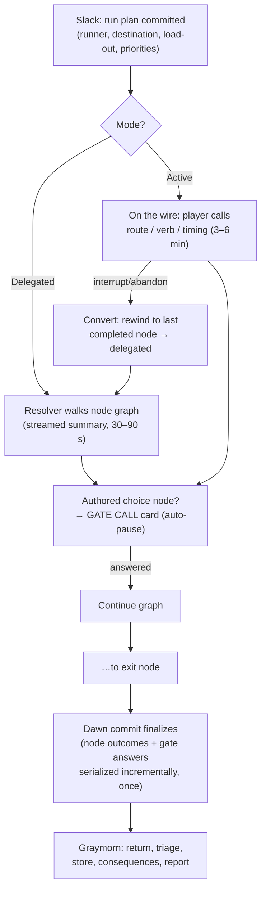

# 12 — PHASE AND SESSION FLOW

**Stage:** Prompt 2. **Status:** LOCKED at structural level; durations are model-validated baselines (15).
**Presentation rule (D-040):** every phase carries a plain-language label with the canon name as flavor, presented as e.g. **"DAY SHIFT — Swelter"**. Players never need to memorize unexplained terminology; the plain label leads in UI, the canon name colors it. Audit result: the four-phase sequence remains clear under this presentation — no phase was renamed or merged.

---

## 1. Phase definitions

### 1.1 DAY SHIFT — Swelter

- **Fiction:** the surface is lethal; the station works under its own lights.
- **Entry:** from Graymorn's report confirmation (or campaign start). Autosave on entry.
- **Purpose:** shelter management — construction/reclamation, repair, production, treatment, assignments, utility management (load board), visitor handling, internal events.
- **Available actions:** works orders (all five workflows — see §4), load-priority board, room/ledger inspection, event cards, visitor negotiations, arbitration, crafting (fabrication orders), speed control.
- **Auto-pause:** modal cards per the tier table (11 §3.2); build lens open = cards queue **but auto-pause-tier events still pause the simulation immediately** (the card waits at the lens exit); inspection = 25% slow.
- **Safe stops:** after every confirmed decision (2–5 min rhythm); explicit safe-stop marker after each completed works stage and each resolved card.
- **Exit:** player confirms "end shift" (prompted when the works queue is set and no modal is open) → autosave.
- **Duration:** **4–7 min** ordinary play (model day: total 10.4–11.6 with all phases; Swelter is the largest share). Unlimited paused time.

### 1.2 EVENING WINDOW — Slack

- **Fiction:** dusk; heat falls; the one calm planning hour.
- **Entry:** end of Swelter. Autosave. No crisis may *begin* in Slack (scheduler rule).
- **Purpose:** review unfinished work and tomorrow's priorities; prepare beds/treatment/security; **the radio schedule** (2 slots); route intelligence review; nightrun provisioning and assignment; the active-vs-delegated choice.
- **Available actions:** signal board (allocation view), run planner (one screen, ≤6 taps), works-queue reorder, standing-order edits.
- **Safe stops:** after the radio schedule commits; after the run plan commits.
- **Exit:** confirm the night → autosave. If no run: straight to the quiet-shift resolution.
- **Duration:** **1–3 min.**

### 1.3 NIGHT OPERATION — Nightrun

- **Fiction:** the cool dark; the door opens, or the station keeps its quiet shift.
- **Entry:** Slack confirmation. The run's committed plan is serialized *before* resolution begins.
- **Purpose:** resolve the night — delegated or on the wire; meanwhile the station runs its quiet shift (rest, watch, radio processing).
- **Delegated flow:** ~**30–90 s** — brief staged summary as the resolver walks the node graph; **gate calls** (authored choice nodes) surface as radio decision cards, auto-pausing; confirm advance to dawn.
- **Active "on the wire" flow:** ~**3–6 min** — the runner traverses; the player makes the calls (route, verb, timing, withdraw, carry commitment) against the air/heat clock; interruption-safe at node checkpoints; abandon-to-delegate always offered.
- **No-run night:** ~15 s of quiet-shift transition.
- **Safe stops:** at every completed node (active); at every gate call answer; at dawn commit.
- **Exit:** dawn → results serialized → Graymorn. Autosave.
- **Duration:** **0–6 min** depending on mode.

### 1.4 RETURN & REPORT — Graymorn

- **Fiction:** pre-dawn; the accounting.
- **Entry:** dawn commit. The return is staged at the Scrubber Gate.
- **Purpose:** receive the expedition; triage injuries (treatment commits Medicine at triage — 17 §3); store recovered goods; resolve landed consequences (arrivals, faction bills, chain events); relationship reactions; the **morning report** (stationmaster's log): what changed, what was deferred, what tomorrow's headline is.
- **Available actions:** triage choices, storage decisions, event cards that land at dawn, report review.
- **Safe stops:** report end is the day's marquee stop — the exhale by design (Pillar 5).
- **Exit:** confirm the report → autosave → next Day Shift.
- **Duration:** **2–4 min.**

## 2. Validated timing (feasibility model, 15)

| Day type | Target | Model result |
|---|---|---|
| Delegated full day | 8–12 min | 10.6–11.6 min (week avg 11.5) |
| Active-run day (nights 2/3/5) | 11–16 min | 14.9 min |
| Storm day (no run) | — | 11.0 min |
| Day 1 (guided) | ≤15 min (07 §1) | 11.1 min |
| Day 7 (relay finale, +3 min scene) | — | 13.0 min |
| Seven-day totals | 60–100 min | **80.2 delegated / 90.1 all-active** |
| Active share of playtime | ≤ ~1/3 | 15.0% (3 runs × 4.5 min) |
| Safe-stop spacing | every 2–5 min | structural + measured (07 §1's ≤5-min max-interval criterion) |

## 3. Mobile stopping points and interruption matrix

Every cell below is a hard rule; 07 §16's save-kill-restore rig tests them.

| Interruption | Save point | Resume state | Time advanced? | Pending decision? | Duplication guard |
|---|---|---|---|---|---|
| Incoming call / app backgrounded | Instant snapshot | Exact state, paused, pause chip explains | No | Preserved un-committed | Saves are idempotent snapshots |
| Device locked | Same as backgrounded | Same | No | Preserved | Same |
| Closed during construction | Snapshot incl. works stage progress | Work resumes at the same stage | No | — | Stage completions are single-commit |
| Closed during phase transition | Transition is atomic: pre- or post-state only | Whichever side committed | No | — | Transition commit is one write |
| Closed during radio selection | Snapshot with board open, slots un-committed | Board reopens, same offers | No | Yes — nothing heard until commit | Schedule commits once, atomically |
| Closed during active-run decision | Last completed node + open call serialized (clock/consumables checkpointed per node) | Call re-presented; or convert to delegated; node re-entry deterministic (persisted seed — no kill-scum) | No | Yes | Node outcomes commit exactly once (D-024) |
| Closed during **delegated** resolution | Last streamed node + any open gate call serialized | Stream continues from that node (persisted seed); answered calls never re-presented | No | Yes (open call only) | Node outcomes and gate answers serialize incrementally, exactly once; dawn commit finalizes |
| Return after days/weeks | Last snapshot | Identical world; log recaps | **Never** | Preserved | — |
| OS kills the app | Last snapshot (≤ seconds old) | Same as backgrounded | No | Preserved | Snapshot write is atomic (temp + rename) |

**Two absolutes:** no irreversible choice is committed before explicit confirmation, and no reward can be granted twice after a reload (all grants are keyed to single-commit world-state transitions).

## 4. Construction workflows (the five player-facing groups — D-040)

The sixteen internal verbs (10 §4) remain the design vocabulary but surface as **five workflows**; the UI shows only the actions relevant to the selected section, room, or object — never the full vocabulary:

| Workflow | Contains (internal verbs) | Surfaces when |
|---|---|---|
| **RECLAIM** | Survey, Clear, Drain, Reinforce, Excavate | A blocked/unsafe section is selected |
| **CONNECT** | Connect (access: stairs/ladders/lifts/corridors), extend utilities, structural support | A reclaimed-but-unlinked section or node is selected |
| **BUILD** | Construct (choose purpose → shell if needed), Furnish | A cleared bay/shell is selected |
| **OPERATE** | Staff, prioritize, Repair, supply, maintain | A functional room/order is selected |
| **ADAPT** | Upgrade, Expand (modules), Specialize, Repurpose, Deconstruct, store equipment | A functional room is selected in the build lens |

The ten-step reclamation sequence (10 §3) is the *model*, not a checklist: a usable kiosk needs only Clear → Furnish → Staff; the flooded gallery needs Survey → Drain → Reinforce → Connect → Build; an intact railcar needs access + Repurpose; the damaged Scrubber Gate needs only OPERATE → Repair. Verb cards show 2–4 ranked actions + the "all works…" expander (10 §16).

## 5. Delegated vs. active mission flow

Both modes traverse the same authored graph and outcome tables (±10% expected-yield band, 07 §10); the run report is the canonical knowledge artifact for both.
