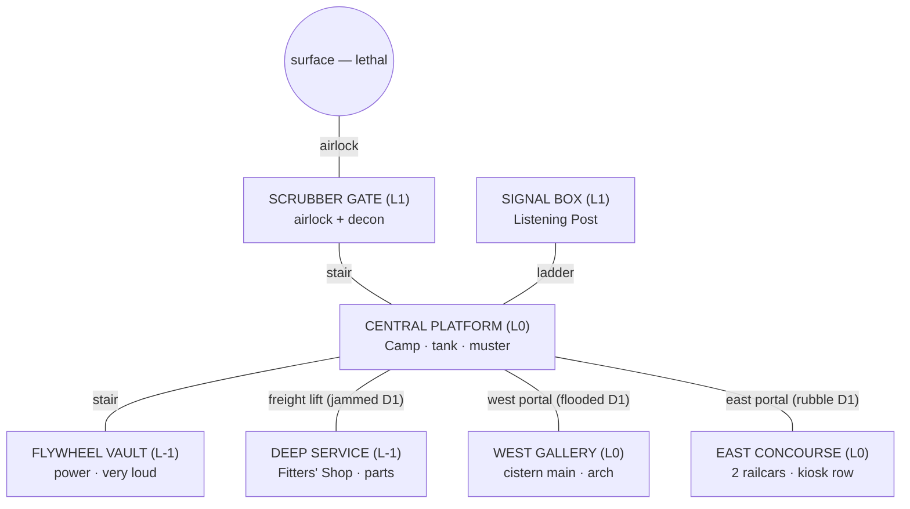

# 26 — VERTICAL-SLICE STATION LAYOUT

**Stage:** Prompt 4 (amended by the D-048 red-team pass). **Status:** LOCKED at systems level; **not final art**. The authoritative geometry is machine-readable — `tools/data/layouts/{day1,east_day7,west_day7}.json` over `station_sections.json` — and validated by `tools/validate_station_layouts.py` (all three layouts pass the full battery, including derived area counts, the medical venue on both routes, the recorded seal, and the no-sever/no-strand guards). The ASCII diagrams below are **generated from that data by the render probe and pasted verbatim** (D-048 — the first hand-drawn versions drifted and were caught); on any conflict, the data wins. Glyphs: `#` column · `=` track/drain bed · `/` stair · `|` ladder · `^` lift (or the west arch) · `x` jammed link · `O`/`X` open/blocked portal · `A` airlock · `d` decon · `S` scrubber stack · `T` tank · `F` flywheel · `c` cable gallery or a c-named object · `r`/`R` railcars · `k` kiosk · `C` cistern · `f` filtration or fitters' bay · `p` pump or parts racks · `!` story anchor · `*` comfort lamp · lowercase = placed objects (b beds, t bench/pump, s shelf/crate, h hotplate, m cot/cabinet/mask, w workbench).

---

## 1. The station graph (all three levels)



## 2. Day 1 — four areas, three blocked routes

```
scrubber_gate (L1):          central_platform (L0):
  A . . . . . S S              p T b # b b b # / . | # . x w w
  O d d . . . . .              X t b . b b b * c c m ! s s . X
  A t t . . . . /              . . . . . / . . c c . . . . . .
                               = = = = = = = = = = = = = = = =
flywheel_vault (L-1):
  / . . . F F . .
  . . . b F F . .
  c c c c c c c c
```

**Areas (4, derived from the rooms' own labels — validator-checked):** Scrubber Gate (impaired; **Ash's triage bench at the decon channel** — the medical family's temporary form, on every route from Day 1) · Flywheel Room (partial; the battery bank inside — the backup-charge object) · the Camp (bedrolls + cook ring + supply stacks + bench + pump/tank/purifier + the comfort lamp, lit) · Listening Post (improvised, up the ladder). **Blocked:** east rubble (X), west flood (X), jammed lift (x). Trunk_core serves five nodes; east/west trunks dark. Validated: every essential facility reachable; Deep Service correctly *unreachable*.

## 3. Day 7 EAST — comfort first (10 areas)

```
east_concourse (L0):                 deep_service (L-1):
  . . . # . . . # h h k # s s c c     ^ . . # . . . # . . . .
  O . . . . . * . . . . . . . . !     f w w f . ! . . p s s p
  m r m r m r . b R b R b R c c .     f f f f . . . . p p p p
  m r m r r r . b R b R b R . . .
```

**The railcar-role decision, embodied (D-048):** the **Aid Car takes the portal-side railcar** (shortest casualty carry from the gate — entrance→medical 19 cells) and the **Sleeper Car takes the far railcar** (measurably quieter: noise distance 21 vs the Aid Car's — the tradeoff is a computed metric, and the swapped arrangement validates too, so the choice is real freedom, test-asserted). Canteen in the kiosk row (hotplate on the counter, the table on the concourse floor) + pantry module + Cold Store in the end kiosks; Juna's berth = the third bunk. The **Level-1 seal is recorded on the east portal** (the isolation decision, in data); the shift-log story anchor waits in Deep Service. Camp → Staging; LP wired; trunk_east live; lift restored.

## 4. Day 7 WEST — water first (10 areas)

```
central_platform (L0):               west_gallery (L0):
  p T . # s s s # / . | # . ^ . .     C C C f # p p . # b . b # b c c
  O t t t . . . * c c . . m . ! X     C C C f . p p ! ^ b . b * b . O
  . . . . . / . . c c c c . . . .     . . . . . . . . . . . . . . . .
  = = = = = = = = = = = = = = = =     = = = = = = = = = = = = = = = =
```

**Ash's triage-bench corner sits beside the Staging Room** (the D-039 bench venue — the west route's medical family, in data with its placed bench, validator-asserted). Cistern Works (feature-built, +filtration module) · Pump Room · West Bunks with **Juna's lamp beside her bunk** (the candle line's anchor, adjacency-tested) · Cold Store in the far bays (cool, quiet, the long haul — priced by the metrics) · the canteen corner stays a cook-ring zone (cold-meal week canon) · seal recorded on the west portal · shift log in Deep Service. East stays rubble-dark — the visible unchosen future.

## 5. Route contrast (same shell, different stations)

East buys **rooms for people** (real beds, real triage, a warm Canteen) and leaves water on tank-duty drudgery; west buys **infrastructure** (the water chain, cheap storms) and lives rougher (bunks in a work gallery, bench triage at Ash's penalty, cold meals through the drain week, the platform lamps dark more nights). Both reach 10 areas from the same 7 families; both keep every essential facility reachable with an emergency path; the validator asserts both — and asserts that neither is achievable by Day 1 geometry alone (blocked portals, dark trunks, jammed lift).

**The four within-wing decisions, instantiation status (D-048, honest):** *railcar roles* — in data, both arrangements validated, tradeoff computed (noise vs. gate distance); *seal bulkhead* — in data (`seal_bulkhead`), closure/severance/recovery test-exercised; *Cold Store siting* — the two canonical sites are the cross-route pair (east kiosk vs. west bay, D-039), priced by the delivery-distance metrics; *berth location* — canonically a human-ledger call owned by the resident layer (Prompt 5), not a spatial mechanic. The slice's route redundancy is authored-single (every wing room's SPOF is computed and reported, never hidden); *second passages* are full-game content (25 §3).

## 6. Incident propagation on this geometry (worked examples)

**Storm (Day 4)** — labels per D-048's modeled-vs-authored honesty: the demand spike and the shed order (comfort lighting first, then Normal) are **modeled** (survival model, asserted); the pump-link stall staging (west: Pump Room; east/pre-trunk: the Camp's transfer pump per 10 §15) is **authored canon** the incident content stages, not model output. The **seal bulkhead** (Day-2 choice, now in layout data) closes its recorded portal — closure, severance warning, and recovery are exercised against this geometry by `close_door` tests; which side the 3-phase air window threatens follows from it. **Contamination (Day 5):** the STORAGE link is the tank (east) or cistern storage (west) — the boil order's charge cost rides the same load board (modeled). **Structural:** the east canopy bay / west arch hotspots sit exactly where reinforcement orders go; an unstable bay closes its cells (access, not damage theater — authored, geometry-ready).

## 7. Visual-progression checkpoints (screenshot anchors)

Same framing, five checkpoints: **Day 1** (four lit pools in a dark cross — bedrolls, lantern cones, rubble and floodwater visible at both edges) · **Day 4** (chosen wing lit and framed mid-construction, storm dust, trunk lights through the dust — the mid-storm beat) · **Day 7** (8–10 warm areas, one wing alive, the other still dark potential; Juna's corner lit) · **mid-campaign** (Stage 3: both wings + deep level, green under grow-lights, decoration density) · **late campaign** (Stage 4: neighborhoods, memorial wall, mast lights). The Day-1 / Day-4 / Day-7 triplet is the slice's screenshot test (07 §21); the two campaign checkpoints are its full-game extension.
