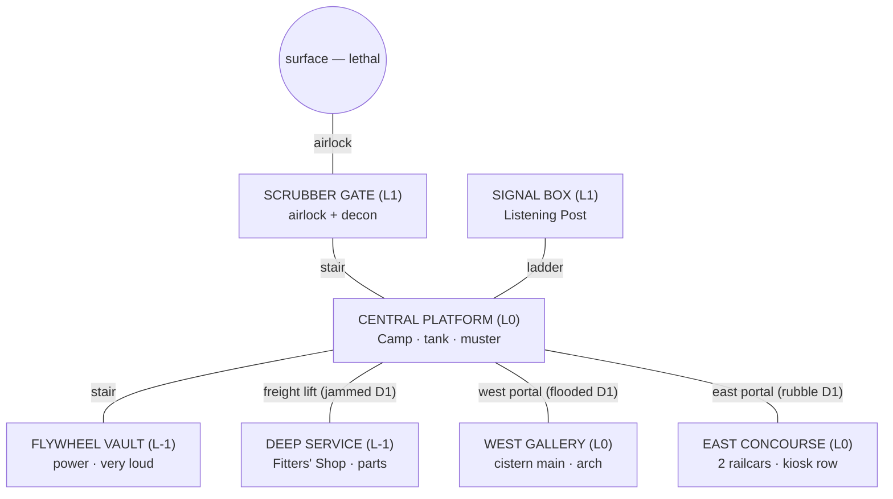

# 26 — VERTICAL-SLICE STATION LAYOUT

**Stage:** Prompt 4. **Status:** LOCKED at systems level; **not final art**. The authoritative geometry is machine-readable — `tools/data/layouts/{day1,east_day7,west_day7}.json` over `station_sections.json` — and validated by `tools/validate_station_layouts.py` (all three layouts pass the full battery). The diagrams below are *renderings of that data*; on any conflict, the data wins.

---

## 1. The station graph (all three levels)



## 2. Day 1 — four areas, three blocked routes

Central Platform (16×4 cells, 4 bays; `#` column, `T` tank, `=` track bed, `/` stair, `|` ladder, `^` lift):

```
  P T b # b b b # / . | # . ^ s .      P purifier  b bedrolls (the Camp)
  X t . C . . . c c c m . s s . X      t transfer pump  C cook ring  c lamp/cache/chalk
  . . C C C / C . . . . . s . . .      s supply stacks + bench  m muster
  = = = = = = = = = = = = = = = =      X blocked portal (west flood / east rubble)
```

**Areas (4):** Scrubber Gate (impaired) · Flywheel Room (partial) · the Camp (bedrolls + cook ring + bench + pump/tank/purifier — three temporary zones, one home) · Listening Post (improvised, up the ladder). **Blocked:** east rubble, west flood, jammed lift. **Utility path:** trunk_core serves gate/platform/signal/flywheel/deep nodes; east/west trunks dark. **Safe areas:** platform + gate; muster mid-platform. Comfort lamp on the platform (the Optional load, lit). Validated: every essential facility reachable; Deep Service correctly *unreachable* (lift-jam test).

## 3. Day 7 EAST — comfort first (10 areas)

East Concourse (railcars `r`/`R` converted, kiosk row `k` claimed):

```
  . . . # . . . # H H c c S S C C      H hotplate counter (Canteen)  c table
  O . . . . . L . . . . . . . . m      S pantry shelf (module)  C cold locker
  b r b r b r . m R m R m R . . .      b bunks ×3 (Sleeper Car; Juna = 3rd)
  b r b r b r . m R m R R R . . .      m med cots + cabinet (Aid Car)  L lamp
```

Sleeper Car (railcar A: 3 bunks, aisles between — Juna's berth the third) · Aid Car (railcar B: 2 cots + cabinet, carer aisles) · Canteen in the kiosk row (+pantry module) · Cold Store in the end kiosks · Camp → **Staging Room** (repurposed) · LP **wired** (upgrade) · Flywheel **stabilized** · trunk_east live · lift restored → Fitters' Shop + Equipment Locker. Corridor row y1 stays clear end to end (validated: no furniture severs it). Emergency route: concourse → portal → platform (safe); the storm seal on this portal is the isolation choice.

## 4. Day 7 WEST — water first (10 areas)

West Gallery (cistern main `C`, arch `^`, drain channel `=`):

```
  C C C f # p p . # b W b # b c c      f filtration module (on Cistern Works)
  C C C f . p p m ^ b c b W b C O      p pump module (Pump Room)  m lamp
  . . . C . . . . . W W W W W . .      b bunks ×3 (West Bunks; Juna = 3rd, lamp corner)
  = = = = = = = = = = = = = = = =      C cold locker (cool, quiet, far from gate)
```

Cistern Works (feature-built on the main, +filtration module) · Pump Room · West Bunks (Juna's berth, the candle-lamp corner) · Cold Store (west option: cool but the long haul) · canteen **corner** stays a cook-ring zone on the platform (the D-039 warm-beat variant) · Camp → Staging · LP wired · lift restored → Fitters' Shop. East stays rubble-dark — the visible unchosen future. Validated identically.

## 5. Route contrast (same shell, different stations)

East buys **rooms for people** (real beds, real triage, a warm Canteen) and leaves water on tank-duty drudgery; west buys **infrastructure** (the water chain, cheap storms) and lives rougher (bunks in a work gallery, cold meals through the drain week, the platform lamps dark more nights). Both reach 10 areas from the same 7 families; both keep every essential facility reachable with an emergency path; the validator asserts both — and asserts that neither is achievable by Day 1 geometry alone (blocked portals, dark trunks, jammed lift).

## 6. Incident propagation on this geometry (worked examples)

**Storm (Day 4):** intake clog spikes scrubber draw at the Gate (L1); power dips station-wide (comfort lighting dims first — visibly, on the platform); the pump link stalls (west: Pump Room; east/pre-trunk: the Camp's transfer pump). The **seal bulkhead** (Day-2 choice) closes either the wing portal or the platform core — deciding which side the 3-phase air window threatens. **Contamination (Day 5):** the STORAGE link is the tank (east) or cistern storage (west) — the boil order's charge cost rides the same load board. **Structural:** the east canopy bay / west arch hotspots sit exactly where reinforcement orders go; an unstable bay closes its cells (access, not damage theater).

## 7. Visual-progression checkpoints (screenshot anchors)

Same framing, five checkpoints: **Day 1** (four lit pools in a dark cross — bedrolls, lantern cones, rubble and floodwater visible at both edges) · **Day 4** (chosen wing lit and framed mid-construction, storm dust, trunk lights through the dust — the mid-storm beat) · **Day 7** (8–10 warm areas, one wing alive, the other still dark potential; Juna's corner lit) · **mid-campaign** (Stage 3: both wings + deep level, green under grow-lights, decoration density) · **late campaign** (Stage 4: neighborhoods, memorial wall, mast lights). The Day-1 / Day-4 / Day-7 triplet is the slice's screenshot test (07 §21); the two campaign checkpoints are its full-game extension.
