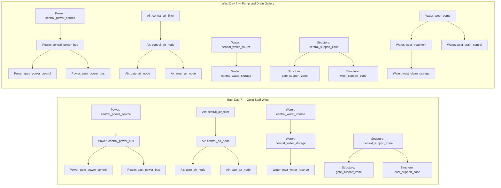

# Utility Topology

> Generated from canonical Day 7 layouts. No player-drawn wires or pipes are implied.

```mermaid
flowchart LR
  subgraph east_day7[East Day 7 — Quiet Staff Wing]
    east_day7_central_power_source["Power: central_power_source"]
    east_day7_central_power_bus["Power: central_power_bus"]
    east_day7_gate_power_control["Power: gate_power_control"]
    east_day7_central_air_filter["Air: central_air_filter"]
    east_day7_central_air_node["Air: central_air_node"]
    east_day7_gate_air_node["Air: gate_air_node"]
    east_day7_central_water_source["Water: central_water_source"]
    east_day7_central_water_storage["Water: central_water_storage"]
    east_day7_central_support_zone["Structure: central_support_zone"]
    east_day7_gate_support_zone["Structure: gate_support_zone"]
    east_day7_east_power_bus["Power: east_power_bus"]
    east_day7_east_air_node["Air: east_air_node"]
    east_day7_east_water_reserve["Water: east_water_reserve"]
    east_day7_east_support_zone["Structure: east_support_zone"]
    east_day7_central_power_source --> east_day7_central_power_bus
    east_day7_central_power_bus --> east_day7_gate_power_control
    east_day7_central_air_filter --> east_day7_central_air_node
    east_day7_central_air_node --> east_day7_gate_air_node
    east_day7_central_water_source --> east_day7_central_water_storage
    east_day7_central_support_zone --> east_day7_gate_support_zone
    east_day7_central_power_bus --> east_day7_east_power_bus
    east_day7_central_air_node --> east_day7_east_air_node
    east_day7_central_water_storage --> east_day7_east_water_reserve
    east_day7_central_support_zone --> east_day7_east_support_zone
  end
  subgraph west_day7[West Day 7 — Pump and Drain Gallery]
    west_day7_central_power_source["Power: central_power_source"]
    west_day7_central_power_bus["Power: central_power_bus"]
    west_day7_gate_power_control["Power: gate_power_control"]
    west_day7_central_air_filter["Air: central_air_filter"]
    west_day7_central_air_node["Air: central_air_node"]
    west_day7_gate_air_node["Air: gate_air_node"]
    west_day7_central_water_source["Water: central_water_source"]
    west_day7_central_water_storage["Water: central_water_storage"]
    west_day7_central_support_zone["Structure: central_support_zone"]
    west_day7_gate_support_zone["Structure: gate_support_zone"]
    west_day7_west_power_bus["Power: west_power_bus"]
    west_day7_west_air_node["Air: west_air_node"]
    west_day7_west_pump["Water: west_pump"]
    west_day7_west_treatment["Water: west_treatment"]
    west_day7_west_clean_storage["Water: west_clean_storage"]
    west_day7_west_drain_control["Water: west_drain_control"]
    west_day7_west_support_zone["Structure: west_support_zone"]
    west_day7_central_power_source --> west_day7_central_power_bus
    west_day7_central_power_bus --> west_day7_gate_power_control
    west_day7_central_air_filter --> west_day7_central_air_node
    west_day7_central_air_node --> west_day7_gate_air_node
    west_day7_central_water_source --> west_day7_central_water_storage
    west_day7_central_support_zone --> west_day7_gate_support_zone
    west_day7_central_power_bus --> west_day7_west_power_bus
    west_day7_central_air_node --> west_day7_west_air_node
    west_day7_west_pump --> west_day7_west_treatment
    west_day7_west_treatment --> west_day7_west_clean_storage
    west_day7_west_pump --> west_day7_west_drain_control
    west_day7_central_support_zone --> west_day7_west_support_zone
  end
```
